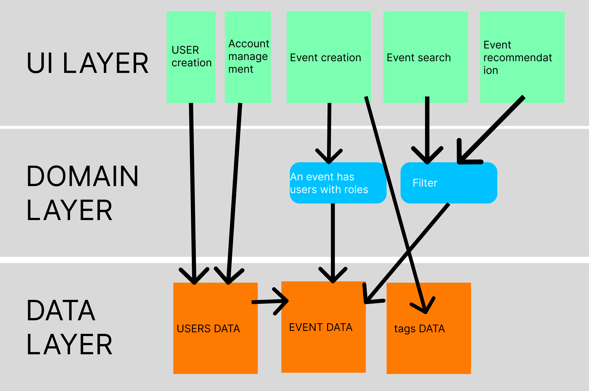

# ChimpagneApp

Tired of the party planning chaos? Chimpagne streamlines it all in one application : easy guest invites, seamless location sharing, automated reminders, beverage coordination, real-time updates. Download now and throw stress-free parties. Life's too short for party planning headaches.


"Building an event organisation application” :

- Check-in: Ensures quick access to the event via QR code or invite link.
- Task management: To organise and track preparations effortlessly with reminders.
- Polls & voting: Facilitates group decisions.
- Shared budget & purchases: Simplifies collective expense control.
- Shared playlist: Creates a collaborative musical atmosphere using Spotify.  
- Group and private chat: Enables instant communication.
- Share the party/event with other people that aren’t in the organisation
- Research public parties that are close to your location 
- Party rating & review system ⭐⭐⭐⭐
- Party tag for what kind of party it is (this is set up by the organiser)
- Weather Info: Have a bar that indicates if and when it's going to rain (plus reminder)
- Permission Handling: One admin (creates event), multiple possible organisers (added later on) and event goers (who don’t have access to the organisation part of the event). 
- Car pooling : number of seats, departure time, destination, etc.. ,  “trust me I am not drunk”
- Organizing who can sleep on site with reservation 

# Architecture diagram



# UI

## Design system

Material design has been unanimously choosen

## Sonar

https://sonarcloud.io/summary/overall?id=Chimpagne_ChimpagneApp

## Figma

[https://www.figma.com/team_invite/redeem/XYJd1jV6IDQFRKusTIYNgO](https://www.figma.com/file/EfCQDVZTCt10o1LOw7R6H9/APP?type=design&node-id=0%3A1&mode=design&t=S1m3KVTdSztS7SgU-1)

## Standup Meetings

Link to minute notes: https://docs.google.com/spreadsheets/d/141KT7RH3QI2LVfiPTD8mgh-nVC4h1Q4AaNwIAWp7860/edit#gid=0

- Scrum Master Sprint 1 : Juan Bautista Iaconucci
- Scrum Master Sprint 2 : Clément
- Scrum Master Sprint 3 : Léa
- Scrum Master Sprint 4 : Arnaud

- Product owner Sprint 1 : The coaches
- Product owner Sprint 2 : Arnaud
- Product owner Sprint 3 : Gregory
- Product owner Sprint 4 : Sacha


## How to setup the project on your device

1. Clone the repo
2. Add this to secrets.properties (not local.properties and NOT secrets.default.properties)

    ```MAPS_API_KEY=YOUR_API_KEY_HERE```